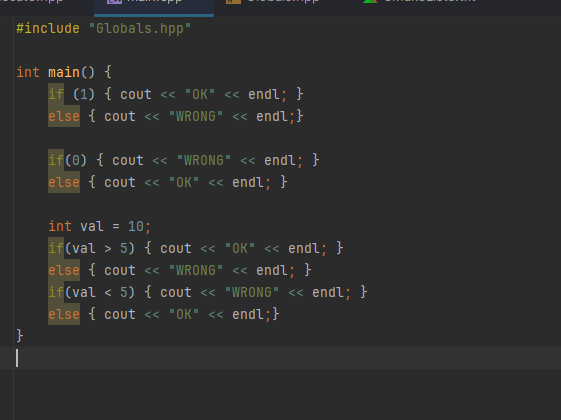
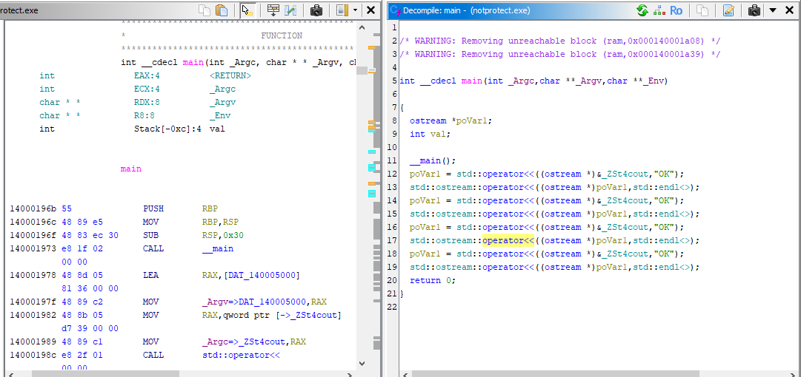
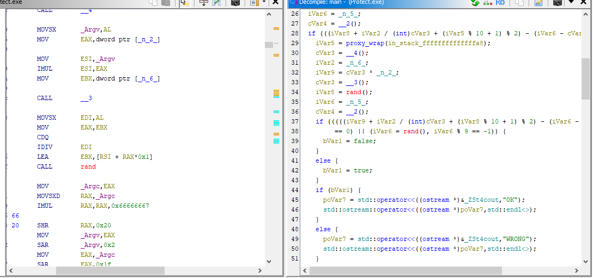

# ObfusGuard

ObfusGuard is a C++ header file designed to obfuscate code for enhanced security. It prevents static analysis and reverse engineering by manipulating control flow, wrapping functions, and introducing other techniques to obscure the program’s logic.

## Features

- **Control Flow Obfuscation**: Dynamically alters the execution path of the program, making it harder to follow.
- **Inlining Prevention**: Key functions are marked to prevent inlining, preserving their structure and adding complexity.
- **Randomized Operations**: Introduces random calculations to further obscure the program's behavior.
- **Proxy Function Wrapping**: Functions are wrapped in proxies to add extra indirection and confuse reverse engineering tools.

## Usage

1. Include the header file in your C++ project:
   ```cpp
   #include "OBFUSCATE.hpp"
   ```

2. Enable control flow obfuscation by setting `CONTROL_FLOW_BRANCHING` to `1`:
   ```cpp
   #define CONTROL_FLOW_BRANCHING 1
   ```

3. The obfuscation techniques will automatically be applied when using the provided functions and macros.

## Snapshots

Here are some snapshots showing the difference between the source code, unprotected decompiled code, and protected decompiled code:

- **Source Code**: Snapshot of the original source code before obfuscation.
  
- **Unprotected Decompiled Code**: Snapshot of the code after decompiling an unprotected version.
  
- **Protected Decompiled Code**: Snapshot of the code after decompiling an obfuscated version.
  

## License

This project is licensed under the MIT License - see the [LICENSE](LICENSE) file for details.

## Future Goals

- [x] Obfuscate `else` Blocks
- [ ] Obfuscate `for` and `while` Loops
- [ ] Implement Advanced Randomization
- [ ] Add Additional Compiler Directives

---